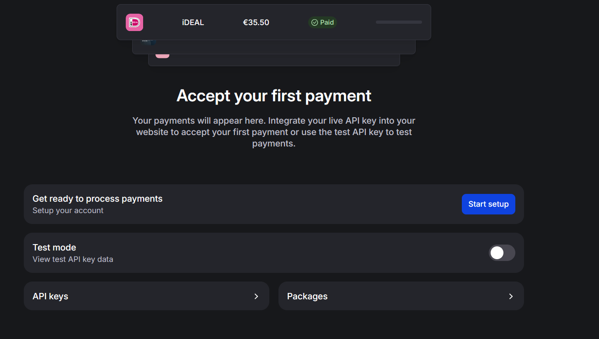
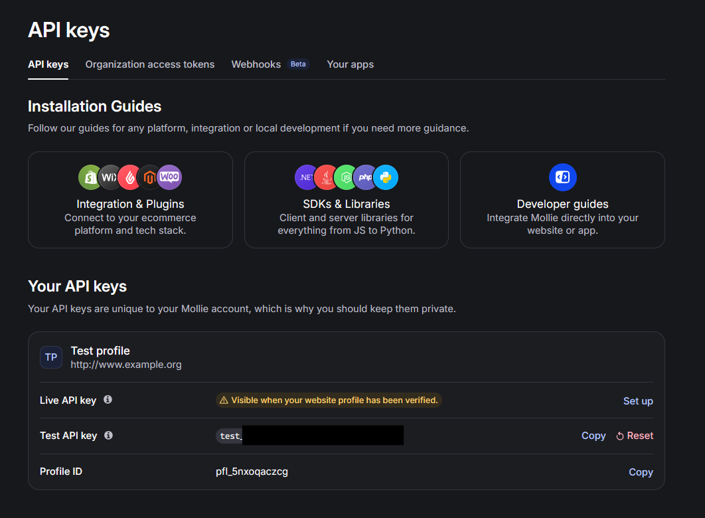
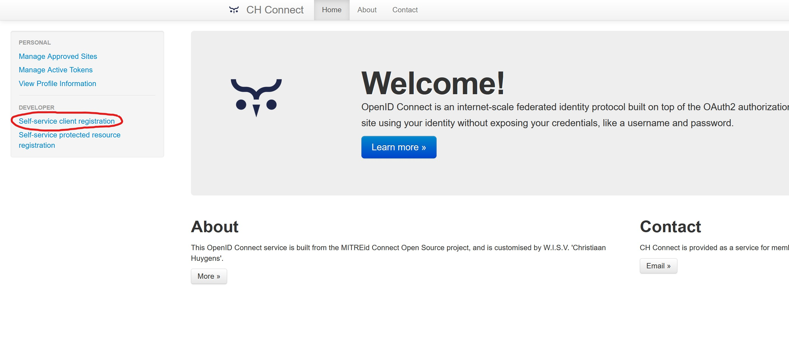
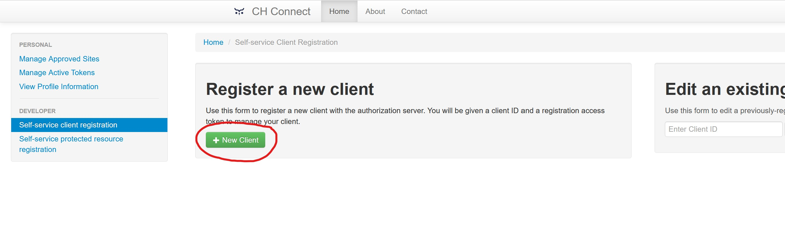
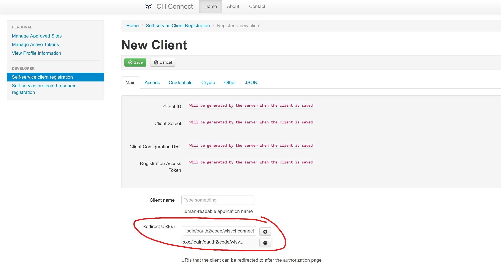
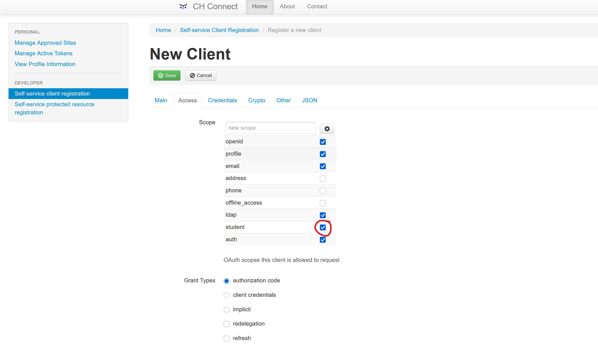
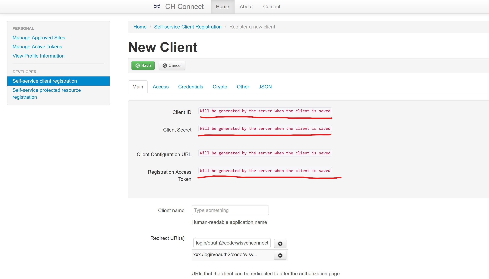

# CHPay

A wallet system for W.I.S.V. 'Christiaan Huygens'.

# Getting started

## Built with

* 
* 
* 

## Installation

This project uses Gradle for dependency management and building.

#### Prerequisites

Before you begin, ensure you have the following installed:

- **[Java Development Kit (JDK) 21](https://www.oracle.com/java/technologies/downloads/) or higher**
- **[Node.js](https://nodejs.org/) (for frontend development)**
- **[Git (optional, but recommended for cloning)](https://git-scm.com/downloads)**
- **[PostgresSQL](https://www.postgresql.org/)**


Required external services:
- **[Mollie api connection](https://docs.mollie.com/reference/overview)**
- **[CH Connect service registration](https://connect.ch.tudelft.nl/)**

## Setting up external service connections:


### **[Mollie:](https://mollie.com/)**
1. After logging in, begin by creating a new organization

2. Go to the payments tab from the navbar on top of the screen, you should setup the account so you can get ready with processing payments 

3. Now you can go to the API keys section and include them in your application.yml 

4. Below are the environmental variables you need to set
```
spring:
  application:
    base-url: ${BASE_URL:XXX}

mollie:
  apiKey: ${MOLLIE_API_KEY:xxx}
  redirectUrl: ${spring.application.base-url}/XXX
  webhookUrl:  ${spring.application.base-url}/XXX
  transactionFee: ${TRANSACTION_FEE:0.32}
```
BASE-URL: The url the application is served on 

MOLLIE_API_KEY: Mollie's API key, either test or live 

TRANSACTION_FEE: A fee that gets added on top of every topup transaction

Note: For Mollie to work, the base URL must be reachable from an external network, otherwise Mollie will not be able to communicate.


### **[CH Connect:](https://connect.ch.tudelft.nl/)**
1. Visit the [CH Connect website](https://connect.ch.tudelft.nl/) and log in
2. Click Self-service client registration


3. Click "New Client"


4. Scroll down to 'Redirect URI(s)', and add a new entry of your base application URL, adding "/login/oauth2/code/wisvchconnect". eg. https://[example.com]/login/oauth2/code/wisvchconnect


5. Go to the 'Access' tab, and under scope, in addition to the default options also make sure 'student' is checked.


6. Leave everything else as the default option and click 'Save'
7. Take note of the underlined newly generated tokens 

8. Add the following environmental variables:
```  security:
    oauth2:
      client:
        registration:
          wisvchconnect:
            client-id: ${CHCONNECT_CLIENT_ID:xxxx}
            client-secret: ${CHCONNECT_CLIENT_SECRET:xxxx}
```
CHCONNECT_CLIENT_ID: the Client ID as generated in step 7.

CHCONNECT_CLIENT_SECRET: the Client Secret as generated in step 7.


### To get a local copy of the project: 
1. Clone the repository using Git:

```bash
git clone https://gitlab.ewi.tudelft.nl/cse2000-software-project/2024-2025/cluster-e/06b/06b.git

cd 06b
```
2. Create a PostgresSQL database.
3. Set the following required environmental variables in **application.yml**:

```
datasource:  
  transactiondb:  
    url: ${TRANSACTION_DB_URL:xxx }  
    username: ${TRANSACTION_DB_USER:xxx}  
    password: ${TRANSACTION_DB_PASS:xxx}  
    driverClassName: org.postgresql.Driver
spring:
  profiles:
    active: ${SPRING_ACTIVE_PROFILE:xxx}
  application:
    name: 06b
    base-url: ${BASE_URL:xxx}
  mail:
    host: ${SMTP_HOST:xxx}
    port: ${SMTP_PORT:xxx}
    username: ${MAIL_USERNAME:xxx}
    password: ${MAIL_PASSWORD:xxx}
```
TRANSACTION_DB_URL: The URL of the PostgreSQL database used by the application

TRANSACTION_DB_USER: Username for the database

TRANSACTION_DB_PASS: Password for the database

SPRING_ACTIVE_PROFILE: either 'test' or 'default'. When set to 'test', the application is **NOT** safe to run in a live instance. It exposes a test authentication controller required for the included playwright end-to-end tests, which gives full admin access without checking credentials.

BASE_URL: The base URL the application will be visited through, eg. https://example.com

SMTP_HOST: The URL of the SMTP host used to send emails

SMTP_PORT: The port used with the SMTP host

MAIL_USERNAME: Username used to log in to the SMTP host

MAIL_PASSWORD: Password used to log in to the SMTP host

4. If desired, set the following **optional** environmental variables:
```chpay:
  transactions:
    expire-every-minutes: ${EXPIRE_EVERY_MINUTE:20}
    expiration-fixed-rate: ${EXPIRATION_FIXED_RATE:1}
  paymentrequests:
    expire-every-months: ${REQUEST_EXPIRATION_CUTOFF:1}
  settings:
    minTopUp: ${MIN_TOPUP:2}
  api-key: ${EVENTS_API_KEY:xxx}
```
EXPIRE_EVERY_MINUTE: The number of minutes after a transaction was created it should count as expired. DEFAULT: 20

EXPIRATION_FIXED_RATE: The backend will check every x minutes for expired transactions and adjust their status.
The lower it is, the more frequently it checks, which results in increased resource usage. DEFAULT: 1

REQUEST_EXPIRATION_CUTOFF: The number of months after a payment request was created it should be invalidated and set as expired. DEFAULT: 1

MIN_TOPUP: The lowest amount of euros the system allows to be topped up. DEFAULT: 2

EVENTS_API_KEY: If the system is to be integrated into the CH Events system, an api key of both has to be matched, set it here.

Once you have cloned the repository and navigated into the project directory:

5. Build the project using Gradle.

```bash
./gradlew build
```

## Frontend Development

The frontend development happens in the `src/main/resources/templates/` directory where the HTML files are located. The styling is done using **FlyonUI**, **Tailwind CSS**, and other frontend libraries.

### Setting up the frontend build tools:

1. Navigate to the frontend build directory:
```bash
cd src/main/frontend/
```

2. Install Node.js dependencies:
```bash
npm install
```

### Frontend Commands:

- **Build CSS and copy JavaScript files:**
```bash
npm run build
```

- **Watch for changes and rebuild automatically:**
```bash
npm run watch
```

The build process will:
- Copy JavaScript libraries (jQuery, DataTables, FlyonUI) to the static resources
- Compile Tailwind CSS from `styles.css` to `../resources/static/css/main.css`

### Frontend Development Workflow:

1. **Edit HTML templates** in `src/main/resources/templates/`
2. **Edit CSS styles** in `src/main/frontend/styles.css` (Tailwind CSS)
3. **Run the watch command** to automatically rebuild styles when you make changes:
```bash
cd src/main/frontend/
npm run watch
```
4. **Use FlyonUI components** and other frontend libraries in your HTML templates

## Usage

For a detailed account on the usage of the app, please refer to [usage.md](usage.md)

## Miscellaneous

Class and Entity Relationship diagrams of the system can be found in [misc.md](misc.md)