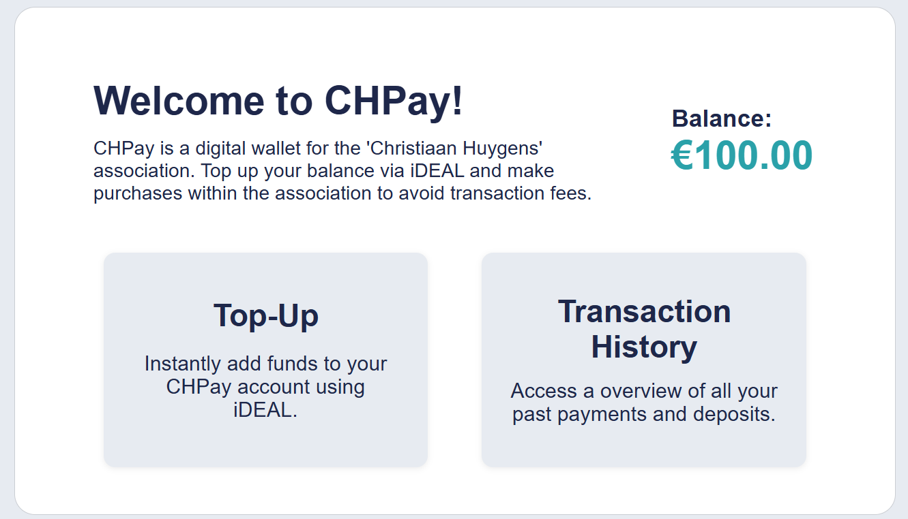
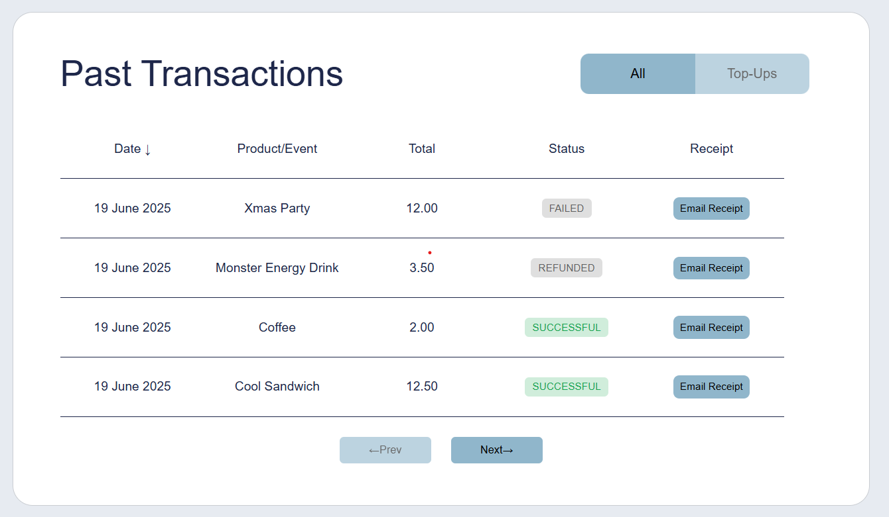
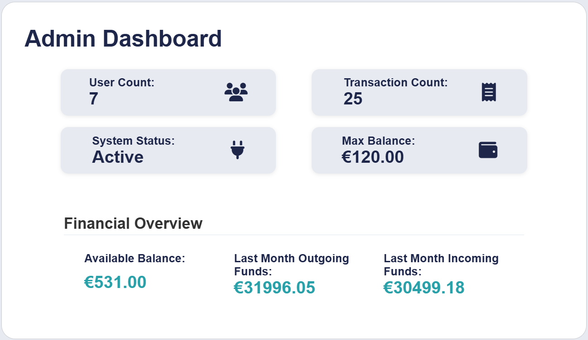
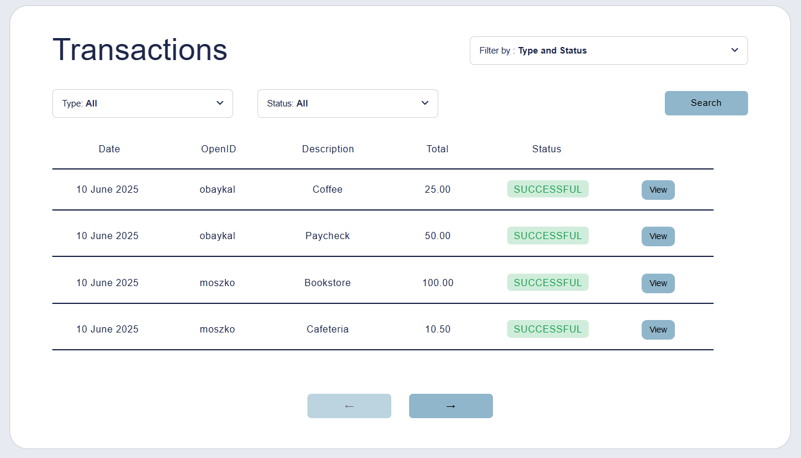
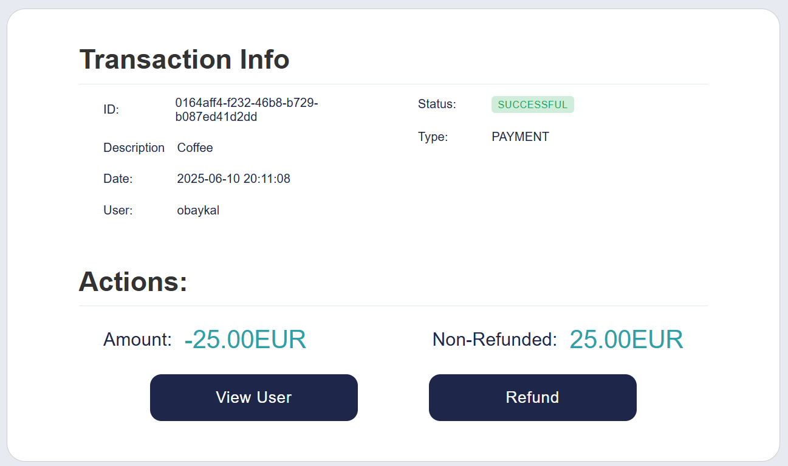
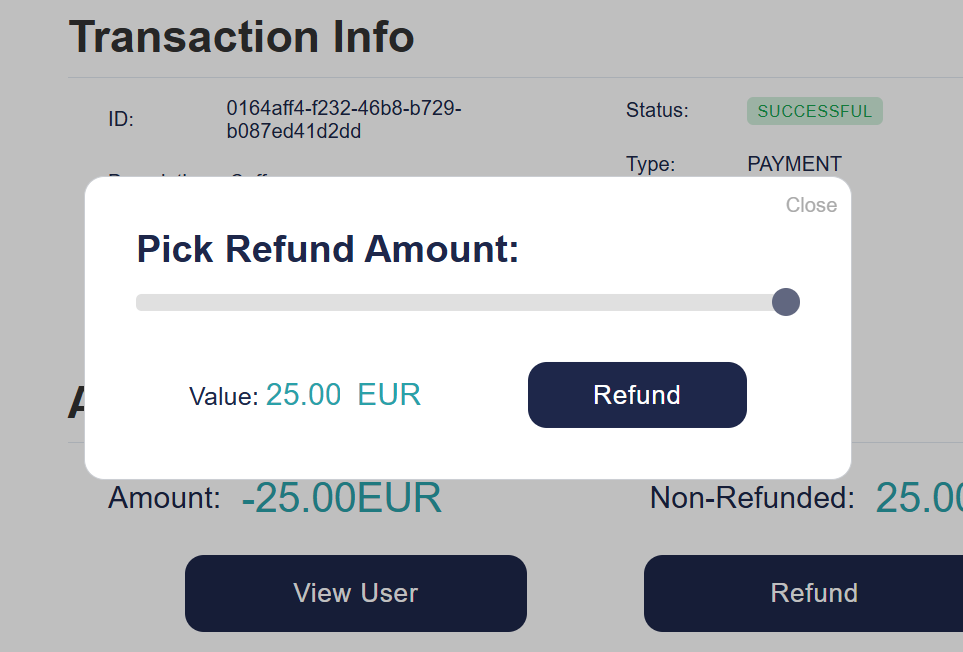
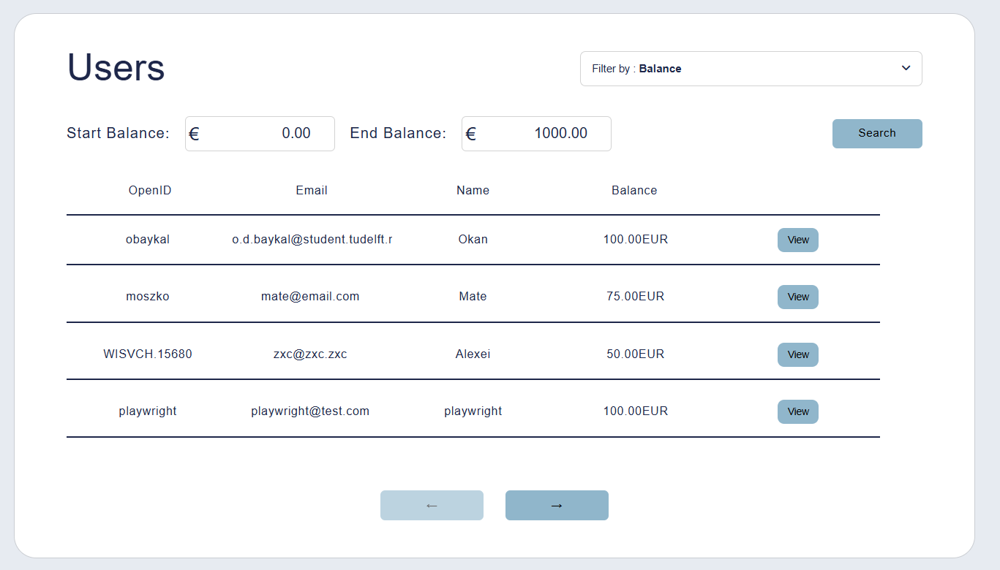
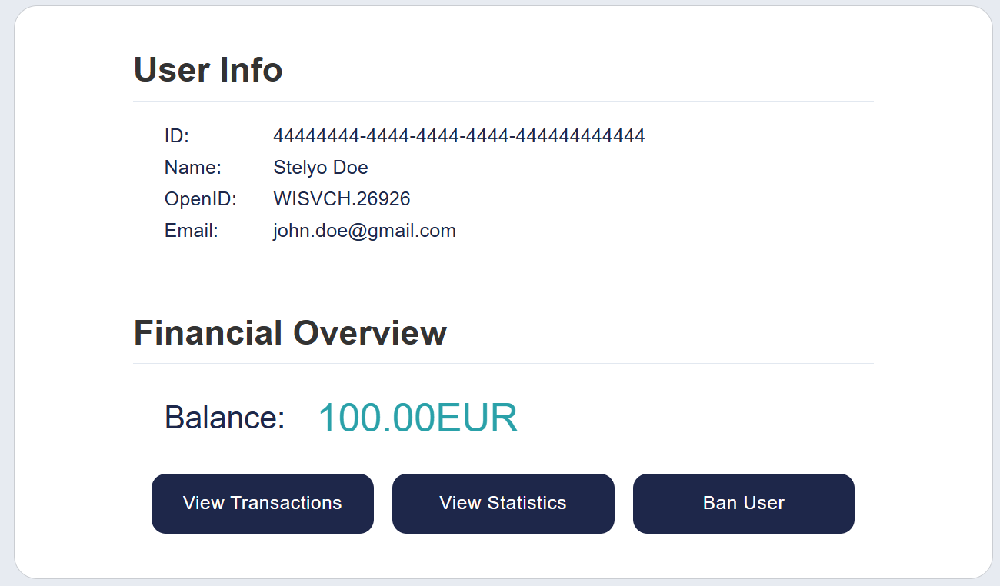

# CHPay Usage Guide

This document provides a comprehensive guide to using the CHPay application, covering all pages and features for both regular users and administrators.

## Table of Contents
- [Regular User Features](#regular-user-features)
  - [Logging In](#logging-in)
  - [Index Page](#index-page)
  - [Balance Management](#balance-management)
    - [Adding Funds](#adding-funds)
    - [Completing Top-Ups](#completing-top-ups)
  - [Making Payments](#making-payments)
    - [Payment Process](#payment-process)
  - [Transaction History](#transaction-history)
    - [Features](#features)
  - [Creating Payment Requests](#creating-payment-requests)
    - [Steps to Create a Payment Request](#steps-to-create-a-payment-request)
    - [QR Code Generation](#qr-code-generation)
    - [RFID Connection](#rfid-connection)
- [Administrator Features](#administrator-features)
  - [Admin Dashboard](#admin-dashboard)
  - [Transaction Management](#transaction-management)
    - [Transaction Table](#transaction-table)
    - [Transaction Details](#transaction-details)
  - [User Management](#user-management)
    - [User Table](#user-table)
    - [User Details](#user-details)
    - [User Statistics](#user-statistics)
    - [Change RFID](#change-rfid)
  - [System Settings](#system-settings)
    - [Available Settings](#available-settings)
  - [Statistics](#statistics)
  - [Admin Logs](#admin-logs)
    - [Log Features](#log-features)
- [Conclusion](#conclusion)

## Regular User Features

### Logging In
The first thing to do in the app is to log in. This assumes your NetID is associated with the Dienst2 Database through being a member of W.I.S.V 'Christiaan Huygens'. If it isn't, you must insert an account with your NetID there before attempting to log in.

{width=400px height=200px}

### Index Page
After logging in, you'll be directed to the dashboard page. This is your central hub for accessing all features of the application. From here, you can:
- View your current balance
- Access balance management
- View recent transactions

### Balance Management
From the balance page you can do several things. For example, you can add money to your wallet, staying mindful of proper formatting and upper limit on the amount of money it can hold.
#### Adding Funds
1. Navigate to the Balance page
2. Enter the amount you wish to add
3. Click "Add Funds"
4. Confirm the transaction through mollie

{width=400px height=200px}

#### Completing Top-Ups
After completing a top-up through the third-party service, you'll be redirected to the payment completion page where you can confirm the transaction was successful.

### Making Payments
Now that you know how to add money to your account, you can attempt a transaction - for example, buying some chips. The video below showcases this process.

{width=400px height=200px}

#### Payment Process
1. Select the item you wish to purchase from the events page or scan the QR code on-site
2. Review the payment details
3. Confirm the payment

{width=400px height=200px}

### Transaction History
You can review your transaction history to examine any transactions you may have made in the past.

#### Features
- View all your past transactions
- Sort transactions by date, amount, or description (descending or ascending)
- Filter transactions by type (Top-ups or All)
- Ability to send email receipts to self

## Administrator Features

### Admin Dashboard
The admin dashboard provides a quick overview of system status and statistics.
It is accessible by clicking the CH logo from the admin view.

### Creating Payment Requests
You can create payment requests for selling products or services on-site:

#### Steps to Create a Payment Request
1. Navigate to the Create Payment Request page
2. Enter the amount and description
3. Choose whether it's a single-use or multi-use request
4. Generate the payment request

#### QR Code Generation
By generating a payment request, the app can create a QR code, prompting others to pay for the item in question. This works for a single scan or several, depending on the toggle you have chosen.

{width=400px height=200px}

#### RFID Connection
The system supports RFID-based payments, allowing users to make purchases using their RFID tags. This contactless payment method provides a quick and convenient way to complete transactions.

**How It Works:**
1. Present your RFID tag to the reader when making a payment
2. The system automatically:
- Identifies you through your registered RFID tag
- Checks your account balance
- Processes the payment for the requested amount

**Important Notes:**
- Ensure your RFID tag is properly registered in the system
- Keep your tag close to the reader during the transaction

For security reasons, each RFID tag is uniquely linked to a single user account.

### Transaction Management
As an administrator, you have access to advanced transaction management features:

#### Transaction Table
- **Search and Filter Transactions**: You can filter transactions using multiple criteria:
  - Date range (inclusive search from start date to end date)
  - Price range
  - User OpenID (searches exact openIDs, separated by a space)
  - User Name (returns all names that like-match the query)
  - Description (returns all descriptions that like-match the query)
  - Transaction Type (Top-Up, Refund, Payment, External Payment)
  - Transaction Status (Successful, Pending, Failed, Refunded, Partially Refunded)

- **Sort Transactions**: Click on column headers to sort by either descending or ascending order:
  - Date
  - Description
  - Total amount

- **Navigate Results**: Use the arrow buttons to move between pages of transaction results

#### Transaction Details
- **See all transaction details available in the system**
  
- **Process refunds**:
  - Issue full refunds with a single click
  - Process partial refunds for specific amounts
  - View refund detail view (treated the same as a transaction detail) when refunds are completed
  - Handle multiple refunds for a single transaction (up to the original amount)
    
- **View related transactions**

### User Management

#### User Table
The user table allows you to:
- **View all users in the system**:
  - See a comprehensive list of all registered users
  - View key information at a glance (name, OpenID, registration date, balance, status)
  - Monitor active and banned users
  - Access user accounts with a single click
  - Navigate through multiple pages of users with pagination controls

- **Search for specific users**:
  - Search by name (partial or full name matching)
  - Search by OpenID for precise user identification
  - Search by balance in a user profile

- **Sort users by different criteria**:
  - Sort alphabetically by name (A-Z or Z-A)
  - Sort by account balance (highest or lowest first)
  

#### User Details
- View comprehensive user profiles with a single click
- See personal details (name, OpenID, email, registration date)
- View current account balance and transaction history
- Access user-specific actions (ban/unban, view statistics, change RFID tag)

#### User Statistics
You can view detailed statistics for each user:
- Income funds over time
- Outgoing funds over time
- Average monthly funds

#### Change RFID
When connected to the RFID service, the administrator can start the action of changing the RFID tag. At that point when a new RFID tag is registered on the scanning device, that tag is saved to the user and is made exclusive to them.

### System Settings
If you want to restrict users from having access to the system due to errors or maintenance, as an admin you can go into the settings menu and initiate a system freeze. This stops any and all transactions from going through until you turn it off.

{width=400px height=200px}

#### Available Settings
- System Freeze: Temporarily disable all transactions
- System Maximum balance: Set a Maximum balance so user do not hold a unnecessary big credits in their accounts

### Admin Logs
The admin logs page allows you to view system logs for monitoring and troubleshooting purposes.

#### Log Features
View all system logs

## Conclusion
This guide covers all the pages and features available in the CHPay application. We hope to expand them in the future and leave a robust environment for the teams that may come after us to do the same.
